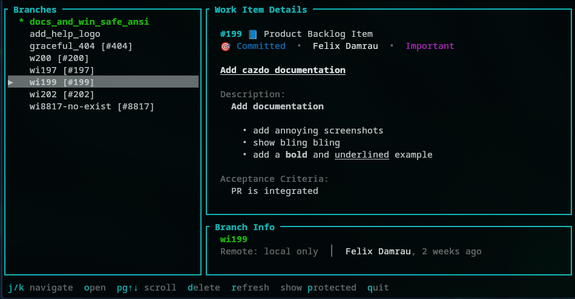

_Cats Do Console Azure DevOps._

`cazdo` is a TUI for Azure DevOps that bridges the gap between your git workflow and issue tracking.

It scans your local branches, extracts work item IDs from their names (e.g., `feature/123-login`), and fetches the corresponding details from Azure DevOps. This allows you to view acceptance criteria, descriptions, and status directly alongside your code.

## Installation

### Linux & macOS

```bash
curl --proto '=https' --tlsv1.2 -LsSf https://github.com/FelixDamrau/cazdo/releases/latest/download/cazdo-installer.sh | sh
```

### Windows (PowerShell)

```powershell
irm https://github.com/FelixDamrau/cazdo/releases/latest/download/cazdo-installer.ps1 | iex
```

## Updating

To update to the latest version, run the installation command again or use:

```bash
cazdo-update
```

## Configuration

### Config File

| Platform | Path                                              |
| -------- | ------------------------------------------------- |
| Linux    | `~/.config/cazdo/config.toml`                     |
| macOS    | `~/Library/Application Support/cazdo/config.toml` |
| Windows  | `%APPDATA%\cazdo\config.toml`                     |

Example config:

```toml
[azure_devops]
organization_url = "https://dev.azure.com/your-org"
# Optional: Set PAT here instead of env var
# pat = "your-pat-token"

[branches]
protected = ["main", "master", "releases/*"]
```

Run `cazdo config init` to create a default config file.

### Personal Access Token

You can set your Azure DevOps PAT in two ways (checked in order):

1. **Environment Variable** (Recommended for CI/CD or temporary overrides):
   ```bash
   export CAZDO_PAT="your-pat-token"
   ```

2. **Config File** (Recommended for daily use):
   Add it to `config.toml`:
   ```toml
   [azure_devops]
   pat = "your-pat-token"
   ```

The PAT needs **Work Items (Read)** scope.

## Usage

### 1. Setup
First, ensure you have configured your Azure DevOps organization URL and PAT (see [Configuration](#configuration)).

### 2. Start the TUI
Run the application in your git repository:

```bash
cazdo
```

### 3. Navigate
The interface lists your local branches. `cazdo` attempts to match each branch to an Azure DevOps work item based on numbers in the branch name.



- **Left Panel**: List of branches.
  - Branches with found work items show the work item type and ID.
  - The current branch is highlighted.
- **Right Panel**: Details of the selected work item.

Use the **Keyboard Shortcuts** below to navigate and interact.

### CLI Commands
```bash
# Initialize config with defaults
cazdo config init

# Show current configuration
cazdo config show
```

## Keyboard Shortcuts

| Key                      | Action                                |
| ------------------------ | ------------------------------------- |
| `j` / `k` / `Arrow keys` | Navigate branches                     |
| `Enter`                  | Checkout selected branch              |
| `o`                      | Open work item in browser             |
| `d`                      | Delete branch (with confirmation)     |
| `D`                      | Force delete branch (no confirmation) |
| `r`                      | Refresh current work item             |
| `p`                      | Toggle protected branches visibility  |
| `PgUp` / `PgDn`          | Scroll work item details              |
| `Ctrl+u` / `Ctrl+d`      | Scroll half page (vim-style)          |
| `q` / `Esc`              | Quit                                  |

## Protected Branches

Branches matching protected patterns are hidden by default and cannot be deleted. The default patterns are `main` and `master`.

Configure custom patterns in `config.toml`:

```toml
[branches]
protected = ["main", "master", "releases/*"]
```

Patterns support `*` wildcards (e.g., `releases/*` matches `releases/v1.0`).

Press `p` in the TUI to toggle visibility of protected branches.

## Branch Naming

cazdo extracts the **first sequence of digits** found in the branch name to use as the Work Item ID.

| Branch Name             | Detected WI |
| ----------------------- | ----------- |
| `wi123`                 | #123        |
| `feature/123-add-login` | #123        |
| `bugfix/issue-42`       | #42         |
| `release/v2.1-fix-123`  | #2          |

Pattern: First sequence of digits found in the string.

## License

MIT
