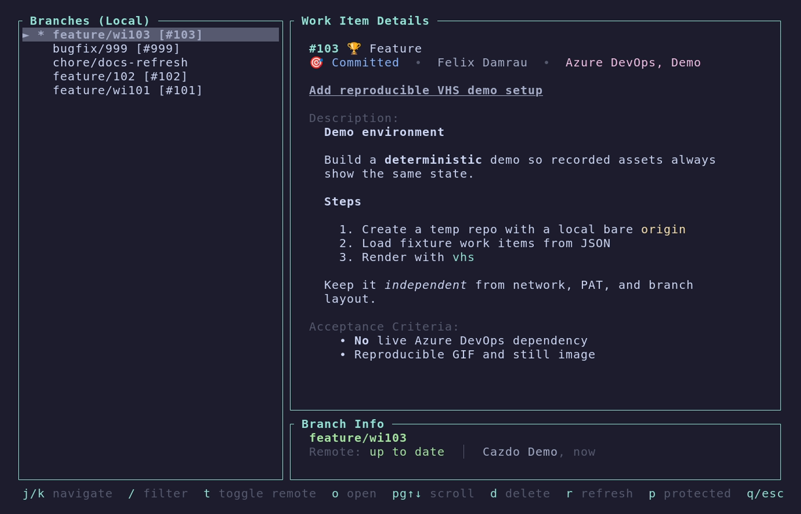

_Cats Do Console Azure DevOps._

`cazdo` is a TUI for Azure DevOps that connects your git workflow to issue tracking.

It scans local branches and `origin` remote branches, finds work item IDs in their names, such as `feature/123-login`, and fetches the matching Azure DevOps details. You can then read acceptance criteria, descriptions, and status beside your code. Markdown and HTML fields appear as formatted text.



## Installation

### Linux & macOS

```bash
curl --proto '=https' --tlsv1.2 -LsSf https://github.com/FelixDamrau/cazdo/releases/latest/download/cazdo-installer.sh | sh
```

### Windows (PowerShell)

```powershell
irm https://github.com/FelixDamrau/cazdo/releases/latest/download/cazdo-installer.ps1 | iex
```

## Updating

If you installed cazdo with the shell or PowerShell installer, run this command to get the latest version:

```bash
cazdo update
```

Update package-manager installations through the package manager you used.

### Migrating from `cazdo-update`

If your installation still includes `cazdo-update`, run it once to install a release with `cazdo update`. Then run `cazdo update`. It removes the old standalone updater from the same installation directory. If cleanup fails, delete `cazdo-update` (`cazdo-update.exe` on Windows) from the directory containing `cazdo`.

## Configuration

### Config file

| Platform | Path                                              |
| -------- | ------------------------------------------------- |
| Linux    | `~/.config/cazdo/config.toml`                     |
| macOS    | `~/Library/Application Support/cazdo/config.toml` |
| Windows  | `%APPDATA%\cazdo\config.toml`                     |

Example config:

```toml
[azure_devops]
organization_url = "https://dev.azure.com/your-org"
# Optional: Set PAT here instead of env var
# pat = "your-pat-token"

[branches]
protected = ["main", "master", "releases/*"]
```

Run `cazdo config init` to create a default config file.

### Personal access token

You can set your Azure DevOps PAT in either of these places. `cazdo` checks them in this order:

1. **Environment variable** (recommended for CI/CD or temporary overrides):

   ```bash
   export CAZDO_PAT="your-pat-token"
   ```

2. **Config file** (recommended for daily use):

   Add it to `config.toml`:
   ```toml
   [azure_devops]
   pat = "your-pat-token"
   ```

The PAT needs **Work Items (Read)** scope.

## Usage

### 1. Setup

Before starting, configure your Azure DevOps organization URL and PAT. See [Configuration](#configuration).

### 2. Start the TUI

Run the application in your git repository:

```bash
cazdo
```

### 3. Navigate

The interface opens with your local branches. Press `t` to switch to `origin` remote branches. `cazdo` matches each branch to an Azure DevOps work item using the numbers in the branch name.


- **Left panel.** List of branches.
  - Branches with found work items show the work item type and ID.
  - The current branch is highlighted.
  - Press `t` to toggle between local and remote (`origin`) branches.
  - Press `/` to edit a shared branch filter. The filter matches all whitespace-separated terms against branch text.
  - Press `Enter` to apply the edited filter, `/` again to refine it, and `Esc` to clear an active filter.
  - In remote view, branches marked with `⚠` no longer exist on `origin`; the cached remote-tracking ref is stale until you prune it yourself.
- **Right panel.** Details of the selected work item.

See the keyboard shortcut tables below to navigate and interact.

### CLI commands

```bash
# Initialize config with defaults
cazdo config init

# Show current configuration
cazdo config show

# Verify org URL + PAT access
cazdo config verify

# Show bounded WI preview for current branch
cazdo wi

# Show bounded WI preview for WI 120
cazdo wi 120

# Show a longer but still bounded WI preview
cazdo wi --long

# Show full Azure DevOps WI JSON
cazdo wi 120 --json

# Update a shell or PowerShell installer-managed copy
cazdo update
```

## Keyboard shortcuts

### Modifier dispatch

| Mode                  | Plain keys              | Shift/other modifiers                                | `Ctrl+C`     |
| --------------------- | ----------------------- | ---------------------------------------------------- | ------------ |
| Branch                | Commands listed below   | Ignored; `Shift+D` is the immediate delete/prune key | Quit         |
| Worktree              | Commands listed below   | Ignored                                              | Quit         |
| Filter                | Text editing, Enter/Esc | Modified commands ignored; Shift may type text       | Cancel draft |
| Branch confirmation   | `y`/`n`/Enter/Esc/`q`   | Ignored                                              | Cancel       |
| Worktree confirmation | `y`/`n`/Enter/Esc/`q`   | Ignored                                              | Cancel       |
| Error popup           | Enter/Esc/`q` dismiss   | Ignored                                              | Dismiss      |

### Branch view

| Key                      | Action                                             |
| ------------------------ | -------------------------------------------------- |
| `j` / `k` / `Arrow keys` | Navigate branches                                  |
| `Enter`                  | Checkout selected branch                           |
| `o`                      | Open work item in browser                          |
| `d`                      | Delete selected branch with confirmation           |
| `Shift+D`                | Delete or prune selected branch immediately        |
| `/`                      | Edit branch filter                                 |
| `r`                      | Refresh current work item                          |
| `t`                      | Toggle local / remote branch view                  |
| `p`                      | Toggle protected branches visibility               |
| `PgUp` / `PgDn`          | Scroll work item details                           |
| `Esc`                    | Clear active filter, otherwise quit                |
| `q`                      | Quit                                               |
| `Ctrl+C`                 | Cancel filter/confirmation, dismiss error, or quit |

### Worktree view

Press `w` to switch between the branch and worktree views.

| Key                      | Action                                                                   |
| ------------------------ | ------------------------------------------------------------------------ |
| `j` / `k` / `Arrow keys` | Navigate worktrees                                                       |
| `d`                      | Remove clean linked worktree or prune missing metadata with confirmation |
| `r`                      | Refresh worktree inventory                                               |
| `w`                      | Return to branch view                                                    |
| `q` / `Esc`              | Quit                                                                     |
| `Ctrl+C`                 | Quit                                                                     |

## Protected branches

Branches matching protected patterns are hidden by default and cannot be deleted. The default patterns are `main` and `master`. The same rule applies to `origin/main`, `origin/master`, and other matching remote branches.

Configure custom patterns in `config.toml`:

```toml
[branches]
protected = ["main", "master", "releases/*"]
```

Patterns support `*` wildcards (for example, `releases/*` matches `releases/v1.0`).

Press `p` in the TUI to show or hide protected branches.

## Development

Install [`just`](https://just.systems/) to use the development recipes:

```bash
cargo install just
```

Run `just` to list the available recipes and their requirements. Before pushing, run `just ci`. It runs the same formatting, lint, build, and test recipes as CI.

## Branch naming

cazdo uses the **first sequence of digits** in the branch name as the Work Item ID.

| Branch Name             | Detected WI |
| ----------------------- | ----------- |
| `wi123`                 | #123        |
| `feature/123-add-login` | #123        |
| `bugfix/issue-42`       | #42         |
| `release/v2.1-fix-123`  | #2          |

Pattern: First sequence of digits found in the string.

## License

MIT
